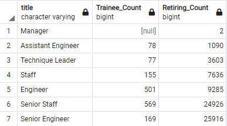

# Pewlett Hackard Analysis 

# Project Overview
The business client Pewlett Hackard has an influx of retirements incoming. The task required analyzing databases to determine the number of employees retiring and the number eligible employees for mentorship. With this information, the client can make accurate hiring decisions.

## Resources

[W3 - Natural Join](https://www.w3resource.com/sql/joins/natural-join.php)

[PostgreSQL - Distinct Clause](https://www.postgresql.org/docs/9.5/sql-select.html)

# Results
- The ERD (Entity Relationship Diagram) shows the relationhips between databases.

## Retiring Employees

- There are seven different titles, organized by pending retirements.
    - Senior Engingeer: 25,916 
    - Senior Staff: 24,926 
    - Engineer: 9,285
    - Staff: 7,636
    - Technique Leader: 3,603
    - Assistant Engineer: 1,090
    - Manager: 2

- Software Engineers and Senior Staff will be in high demand for hiring.
- Promotions won't close the gap. 
    - As shown in the next deliverable, there are simply not enough inside candidates.
- Management is a title that isn't as impacted by retirements.
- 57,668/90,393 employees retiring.
    - 64% of staff retiring.

    
## Mentorship Eligibility

- 1,549/72,458 employees eligible for mentorship.
    - 2.14% eligibility 
- There's simply not enough eligible employees for mentorship.
- There needs to be a much more active training and mentorship program.

# Summary
In summary, there's a significant amount of retirees incoming and a dismal amount of employees eligible to be mentored to fill those spots. 

- Another query that was created was to not only show mentorship count and retiring count separate, but in one table forbetter visualization.

- Shown below is the department retirements to a show another perspectice on hiring needs.
- Development, Production, and Sales departments have the greatest needs.

